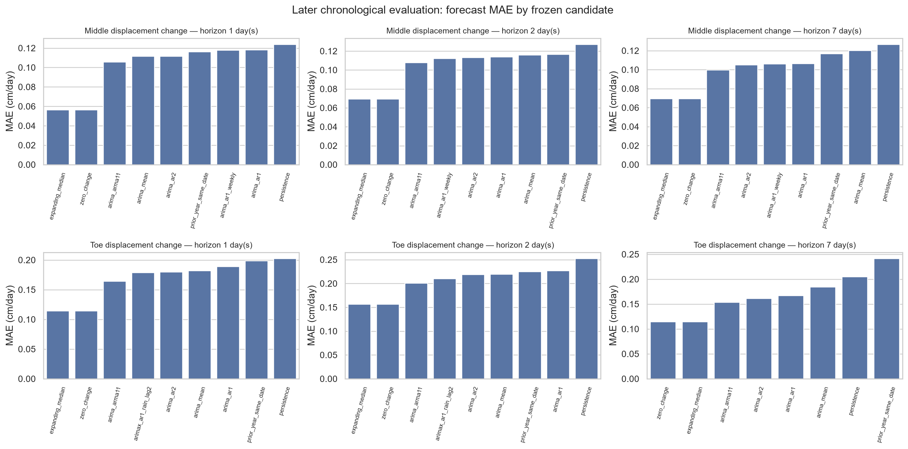

# Cleveland Corral landslide monitoring time-series analysis

A reproducible geotechnical time-series portfolio project built from the official U.S.
Geological Survey monitoring record for the Cleveland Corral landslide near U.S.
Highway 50 in El Dorado County, California.

The engineering problem is deceptively simple: determine what the monitored rain,
soil-moisture, pore-water-pressure, and displacement histories can support about
temporal response and forecasting. The hard part is preserving sensor regimes,
missingness, fixed-PST timing, cumulative resets, and forecast-time information while
resisting causal or operational claims that the observational record cannot justify.

**Canonical deliverable:** [final engineering report](reports/CLEVELAND_CORRAL_FINAL_REPORT.md)

**Auditable evidence route:** [claim-and-evidence matrix](reports/tables/phase5/claim_evidence_matrix.csv)

**Official source:** [USGS DOI 10.5066/P1P9DMFX](https://doi.org/10.5066/P1P9DMFX)

## What the project found

- Rain has prompt same-day or next-day associations with selected moisture and pressure
  changes. The long pre-topple toe window also has a modest two-day
  rain-to-displacement-change association, but middle-site and event-scale timing is
  weak or unstable.
- Large naive rain/displacement correlations shrink sharply after valid differencing
  and cautious prewhitening. Shared accumulation and persistence were important
  confounders.
- In all six untouched long-window evaluations, zero change—tied with the expanding
  median—has the lowest observed MAE. Frozen dynamic and rain-conditioned candidates
  did not add later forecast skill under the declared design.
- Prediction intervals are generally conservative, residuals are heavy-tailed, and
  high-movement evaluation cases are sparse.
- Only 4 of 42 grouped changepoint candidates have support from both method families.
  The result is a sensitivity inventory, not a unique physical segmentation.



These are statements about observed records, statistical association, and forecast
performance under a fixed design. They do not establish an infiltration mechanism,
physical threshold, operational warning skill, alarm rule, or design recommendation.

## Reproducible workflow

The repository follows one traceable route:

```text
official USGS files
  → immutable raw layer and checksums
  → sensor-aware, quality-flagged interim data
  → exploratory and lag diagnostics
  → frozen chronological forecast evaluation
  → validator-backed engineering synthesis
```

Raw and observation-level derived data stay outside Git. Version control contains
source metadata, checksums, reusable code, tests, aggregate tables, inspected figures,
executed notebooks, and the final report.

For a fast clean-checkout audit on Windows:

```powershell
./scripts/setup.ps1
./scripts/reproduce.ps1 -Mode Committed
```

For the full public-source reproduction, including acquisition, SHA-256 verification,
Phases 2–4 rebuilds, Phase 5 synthesis, and clean-kernel notebook execution:

```powershell
./scripts/setup.ps1
./scripts/reproduce.ps1 -Mode Full
```

The rolling forecast rebuild can take several minutes. VS Code is optional; the
workflow runs from PowerShell in the project folder.

## Portfolio navigation

- [Final engineering report](reports/CLEVELAND_CORRAL_FINAL_REPORT.md): concise answer
  to the four engineering questions, with evidence categories and limitations.
- [Phase 1 source audit](docs/data/CLEVELAND_CORRAL_SOURCE_AUDIT.md): official sources,
  sensor inventory, compatibility, and initial viability decision.
- [Phase 2 ingestion and QC report](docs/data/CLEVELAND_CORRAL_PHASE2_INGESTION_QC.md):
  immutable acquisition, parsing, semantics, quality flags, and sensor selection.
- [Phase 3 exploratory report](docs/CLEVELAND_CORRAL_PHASE3_EXPLORATORY_DYNAMICS.md):
  coverage, decomposition, stationarity, ACF/PACF, and lag relationships.
- [Phase 4 forecast report](docs/CLEVELAND_CORRAL_PHASE4_FORECASTING_VALIDATION.md) and
  [frozen contract](docs/phase4/FORECASTING_CONTRACT.md): models, information sets,
  chronological evaluation, uncertainty, residuals, and changepoints.
- [Instructional notebooks](notebooks/README.md): the two executed, restart-and-run
  narratives for Phases 3 and 4.
- [Learning map](docs/LEARNING_MAP.md): UCLA Statistics 170-style topics mapped to
  concrete project artifacts and geotechnical meaning.
- [Active execution plan](docs/exec-plans/active/PROJECT_EXECUTION_PLAN.md): complete
  phase history, acceptance evidence, and durable unresolved questions.

## Repository layout

```text
data/                  Local data layers and committed provenance metadata
docs/                  Phase reports, specification, plan, and learning records
notebooks/             Executed instructional notebooks
reports/figures/       Curated Phase 3 and Phase 4 figures
reports/tables/        Aggregate evidence only, including Phase 5 claim routes
scripts/               Setup, reproduction, build, and verification commands
src/geotech_ts/        Tested reusable ingestion and analysis logic
tests/                  Synthetic and committed-artifact checks
```

## Reproducibility and safety boundary

Every numerical claim in the final report is checked against committed aggregate
artifacts generated by the Phase 2–4 code. Raw files are preserved exactly as obtained;
corrections and transformations occur only in derived layers. Validation is
chronological, preprocessing respects forecast origins, and unavailable future rain is
never inserted into a forecast.

This project is educational and retrospective. It is not a real-time monitoring
system, safety-critical decision tool, causal study, alarm design, or geotechnical
design analysis.

## License

Code is released under the [MIT License](LICENSE). USGS data retain their source terms
and attribution; the release manifest records the applicable CC0/public-domain
dedication.
