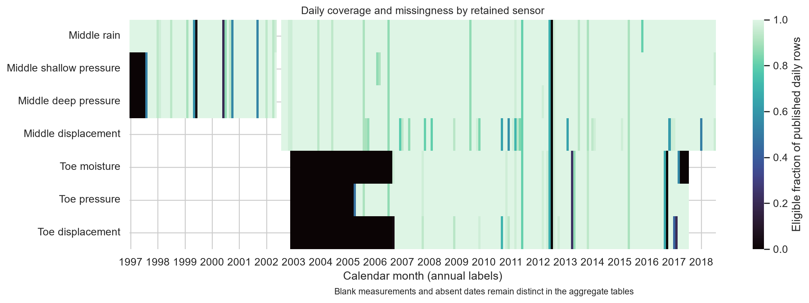
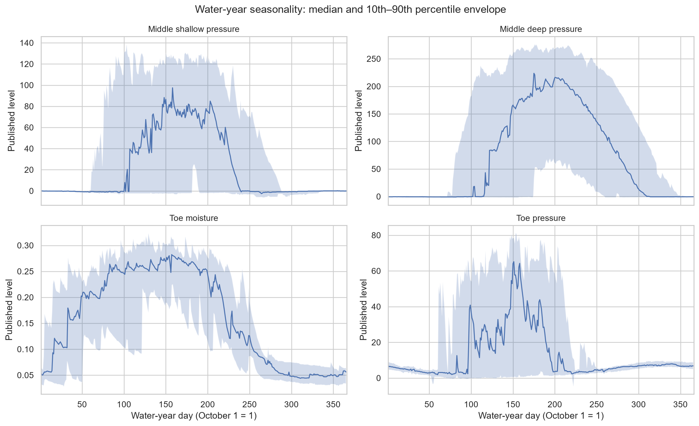
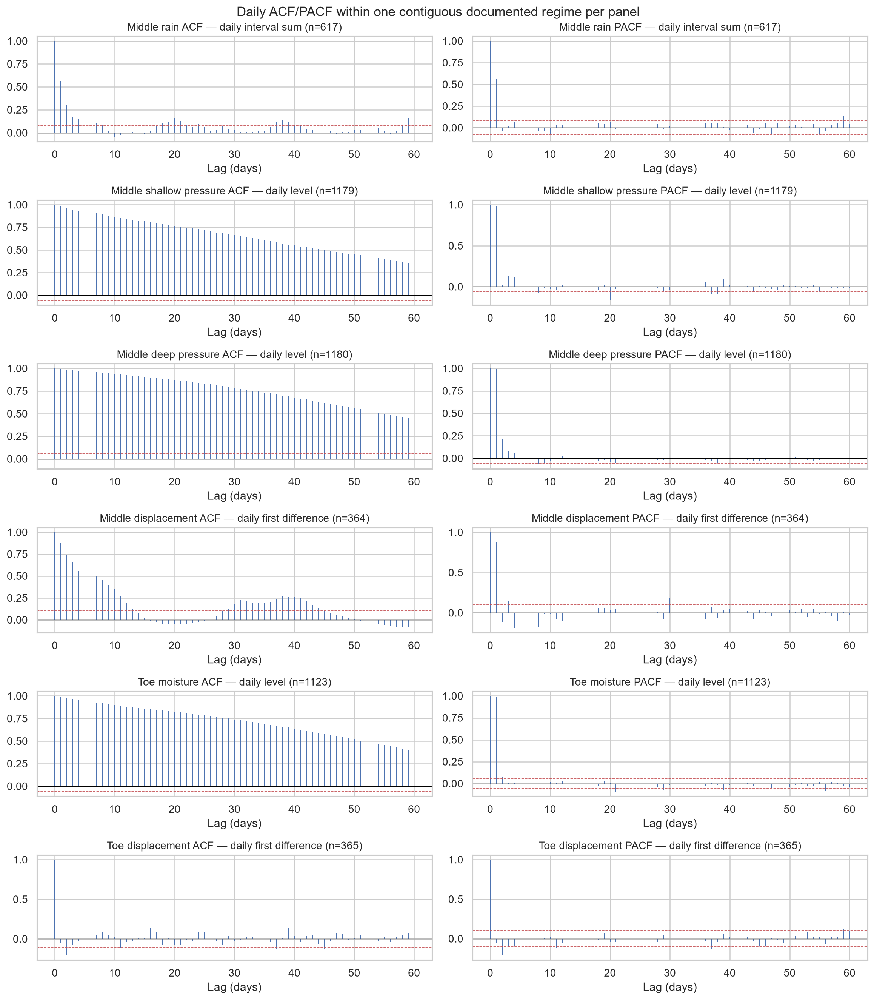
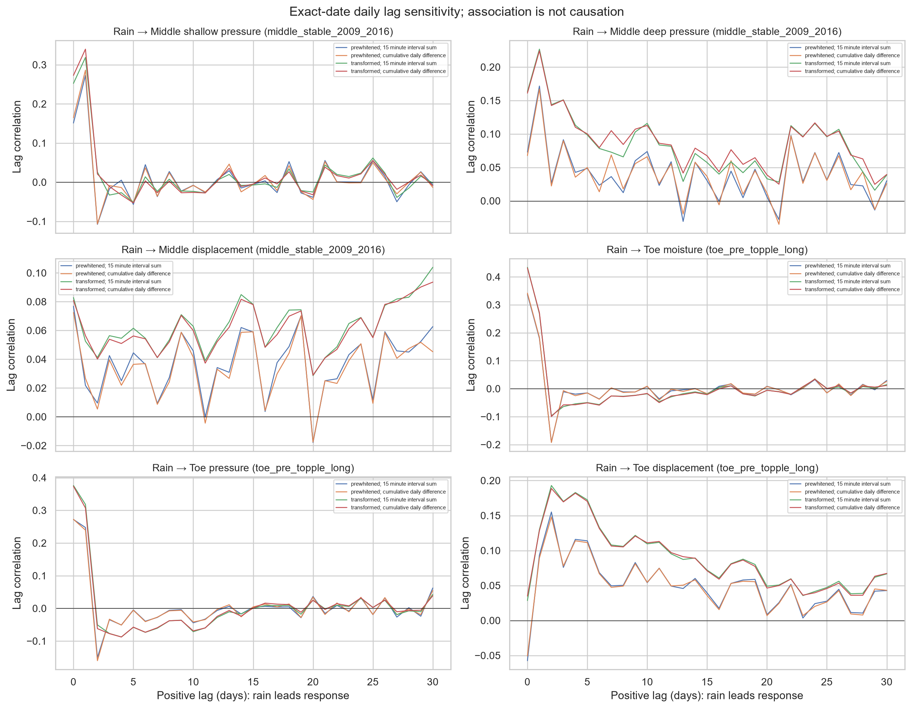
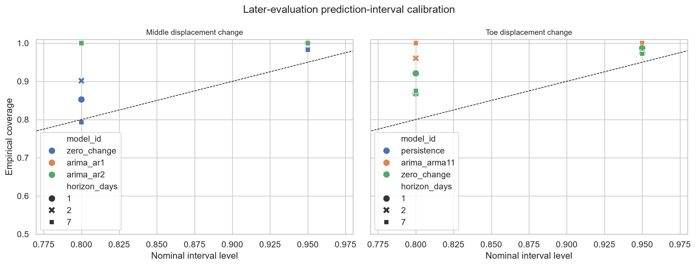
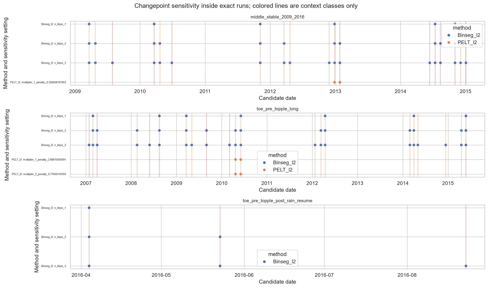

# Cleveland Corral landslide monitoring: time-series evidence and engineering synthesis

**Project purpose.** This report evaluates what official U.S. Geological Survey (USGS)
monitoring records can support about rainfall/snowmelt, soil moisture, pore-water
pressure, and landslide displacement at Cleveland Corral near U.S. Highway 50 in El
Dorado County, California. It is written for an engineering reader and remains
auditable through linked aggregate tables, figures, code, and validators.

**Authoritative format.** This Markdown file is the canonical report. No PDF is
committed because the repository does not include a stable PDF-production dependency;
avoiding a machine-specific conversion keeps the report portable and reproducible.

**Time basis.** Source timestamps are interpreted as fixed Pacific Standard Time
(UTC−08:00) year-round, exactly as stated by the release; daylight-saving behavior is
not inferred.

**Evidence boundary.** The report uses only verified Phase 1–4 evidence. It introduces
no new model selection, lag search, threshold optimization, feature engineering,
changepoint tuning, interpolation, causal analysis, or warning-system design. The
[claim-and-evidence matrix](tables/phase5/claim_evidence_matrix.csv) is generated
directly from the committed Phase 1–4 aggregates and is checked against this report.

## 1. Executive summary

The official archive provides unusually long and useful monitoring records, but their
interpretation depends on respecting missing intervals, cumulative water-year resets,
instrument replacements, relocations, logger timing differences, metadata range
concerns, and unresolved sensor information. The analysis therefore preserves raw
bytes, keeps successor installations separate, constructs changes only across
consecutive eligible dates within one regime, and validates forecasts chronologically.

The central evidence is internally consistent:

- Pressure and toe-moisture levels are highly persistent and show pronounced wet-season
  structure.
- Rain is associated with same-day or next-day moisture and pressure changes. A modest
  two-day rain-to-toe-displacement-change association survives valid differencing and
  cautious prewhitening in the long pre-topple window; the corresponding middle result
  is weak.
- Three rain-selected 15-minute events give substantially different peak lags and even
  different correlation signs. No single high-frequency response lag is supported.
- Large cumulative-level correlations shrink sharply after valid transformations,
  demonstrating how accumulation and autocorrelation can create misleading results.
- Under the frozen rolling-origin design, zero change—tied numerically with the
  expanding median—has the lowest later mean absolute error (MAE) for both displacement
  targets at 1-, 2-, and 7-day horizons. The rain-conditioned ARIMAX candidate does not
  improve long-window MAE.
- Prediction intervals are often conservative, forecast residuals are heavy-tailed,
  and only four of 42 grouped changepoint candidates receive support from both method
  families.

This negative forecasting result is valuable. It shows that a temporal association can
be real enough to describe while still providing no incremental out-of-sample point-
forecast value under the declared model, horizon, origin, and loss function. The
verified results establish temporal association and forecast performance under the
declared design, but they do not establish causation, a physical threshold, operational
forecasting skill, or a warning rule.

## 2. Site and monitoring context

Cleveland Corral is a monitored landslide near U.S. Highway 50 in El Dorado County,
California. The primary USGS release spans monitoring from 1997 through 2018. It
publishes middle-, toe-, and upper-site measurements. The physical hypothesis
motivating the project is:

> precipitation or snowmelt → infiltration and soil-moisture response → pore-water-
> pressure response → possible slope-displacement response

That sequence is an engineering hypothesis, not an assumption built into the
statistical conclusions. The rain gauge is at the middle site, whereas toe moisture,
pressure, and displacement instruments occupy a different local setting. Piezometer
values are pressure head in centimetres of equivalent water above each diaphragm;
extensometer values are centimetres of cumulative downslope displacement within a water
year; precipitation is millimetres of cumulative rainfall and snowmelt within a water
year; the official moisture scale is unitless and its installation depth is not stated.

The official sensor inventory contains 30 IDs and documents gaps, cumulative resets,
replacements, relocations, logger-phase differences, range concerns, and unresolved
metadata that constrain interpretation.

## 3. Data sources and sensor selection

The source is the official USGS monitoring release
[DOI 10.5066/P1P9DMFX](https://doi.org/10.5066/P1P9DMFX), ScienceBase item
`65d8f08fd34ec3e1801e3efc`. Phase 2 acquired only the two monitoring archives and the
sensor-description table. Their sizes, official MD5 values, calculated SHA-256 values,
source URLs, upload timestamps, access timestamp, and CC0 attribution are recorded in
the [download manifest](../data/provenance/cleveland_corral_download_manifest.csv).

The official archives contain 44 15-minute CSV members with 1,300,995 source rows and 5
daily CSV members with 15,070 source rows.

The retained analysis sets are:

| Role | Sensor IDs | Reason for use | Principal constraint |
| --- | --- | --- | --- |
| Primary middle set | `mid_R`, `mid_P1`, `mid_P2`, `mid_E2_B` | Long rain–pressure–displacement overlap | E2 and P1 regimes; rain gaps and daily-product offsets |
| Secondary toe set | `mid_R`, `toe_M1_A`, `toe_P7_B`, pre-topple `toe_E5_C` | Closest available rain–moisture–pressure–movement sequence | Rain gauge at middle site; moisture depth unknown; pre-topple boundary |
| Deferred successors | `toe_M1_B`, `toe_P8_D`, post-relocation `toe_E5_C` | Separate, short later records | Too short and change-heavy for primary inference |

No predecessor and successor installation is silently spliced. Later deep instruments
remain contextual rather than primary. GPS, campaign survey, GIS, topography, and
shear-depth releases were not required for the selected Phase 2–4 questions and were
not acquired.

## 4. Reproducible ingestion and quality control

Raw files remain byte-for-byte unchanged under the Git-ignored `data/raw/` layer. The
downloader fails closed: an existing raw file is accepted only after official-size and
checksum verification; a download is moved into place only after verification. ZIPs
are read without extraction or manual editing.

The ingestion code preserves source timestamp and value strings, source field position,
official sensor ID, installation segment, fixed-PST and UTC timestamps, and explicit
quality flags. Blank sensor cells and absent timestamps are different states; neither
is converted to zero. No value is deleted, clipped, corrected, interpolated, imputed,
smoothed, or automatically spliced.

For the 12 selected non-rain IDs, all 40,160 comparable daily values match the median
recalculated from available 15-minute observations within 10⁻¹². Daily rain matches
the maximum cumulative 15-minute field on 6,961 of 7,584 comparable dates; 623
mismatches are confined to 1999–2000, 2007, and 2013 and remain unresolved. This is why
the lag analysis checks both valid daily cumulative differences and adequately covered
sums of the 15-minute interval-rain field.



*Figure 1 — Observed-data evidence. Fraction of published daily rows eligible by fixed-
PST month for middle rain (`mid_R`), middle pressure (`mid_P1`, `mid_P2`), middle
displacement (`mid_E2_B`), toe moisture (`toe_M1_A`, official unitless scale), toe
pressure (`toe_P7_B`, cm pressure head), and toe displacement (`toe_E5_C`, cm). Black
periods are not measurements of zero. Exact blank-versus-absent counts and segment IDs
are in [coverage_missingness.csv](tables/phase3/coverage_missingness.csv).*

## 5. Exploratory structure, seasonality, and dependence

### Observed data

Pressure and moisture levels show repeated wet-season rises and dry-season declines.
Displacement changes are concentrated near zero with occasional large excursions;
eligible negative changes are retained. Published cumulative displacement resets and
documented instrument regimes prevent treating the full level record as one continuous
stationary series.

### Statistical inference

Daily pressure and toe-moisture levels are strongly persistent: representative lag-1
ACF values are 0.979 for mid_P1, 0.990 for mid_P2, and 0.987 for toe_M1_A.

An autocorrelation function (ACF) measures correlation between a series and its own
lagged values; a partial autocorrelation function (PACF) measures the remaining linear
association at a lag after shorter lags are accounted for. High level ACF values mean
that ordinary observations close in time are far from independent.

A 365-day robust STL description gives seasonal-strength values of 0.51 for mid_P1,
0.61 for mid_P2, 0.95 for toe_M1_A, and 0.61 for toe_P7_B.

STL is a descriptive decomposition into smooth trend, repeating seasonal, and remainder
components. It was allowed only on exact contiguous daily runs at least two annual
cycles long; a 366-day sensitivity was also checked. The seasonal components are not
identified physical mechanisms.



*Figure 2 — Observed data summarized statistically. Median and 10th–90th percentile
envelopes by fixed-PST water-year day for `mid_P1` and `mid_P2` pressure head (cm),
`toe_M1_A` moisture (official unitless scale), and `toe_P7_B` pressure head (cm).
Interannual envelopes are wide; a median seasonal curve is not a deterministic response.*



*Figure 3 — Statistical-inference evidence. Daily ACF/PACF within one exact contiguous
documented regime per panel. Lags are days, correlations are unitless, and dashed bands
are approximate `±1.96/√n`. Panels identify `mid_R`, `mid_P1`, `mid_P2`, `mid_E2_B`,
`toe_M1_A`, and `toe_E5_C`; the plot never crosses a successor or cumulative reset.*

## 6. Lagged relationships

Positive lag means the predictor occurs earlier and leads the response. Daily series
are joined on exact fixed-PST dates without interpolation. The declared search is 0–30
days. Moving-block bootstrap intervals retain short-range dependence but are conditional
on the selected peak and are not simultaneous bands across all searched lags.

Using daily interval rain and cautious AR(1) prewhitening, rain leads mid_P1 and mid_P2
changes by one day with correlations 0.273 and 0.172, respectively.

In the long pre-topple toe window, prewhitened rain associations peak on the same day
for toe_M1_A (0.337) and toe_P7_B (0.272).

The long pre-topple toe rain-to-displacement-change association peaks at two days with a
prewhitened correlation of 0.155.

The corresponding middle rain-to-displacement result is weak: the prewhitened lag-zero
correlation is 0.077.

Naive cumulative-level rain/displacement correlations of 0.603 at the middle and 0.661
at the toe shrink to 0.077 and 0.155 after valid differencing and prewhitening.



*Figure 4 — Statistical-inference evidence. Exact-date lag correlations for published
cumulative-rain differences and daily sums of 15-minute interval rain (mm) against
pressure change (cm/day), moisture change (official unitless scale/day), and displacement
change (cm/day). Positive fixed-PST lag means rain leads the response. `mid_R`, `mid_P1`,
`mid_P2`, `mid_E2_B`, `toe_M1_A`, `toe_P7_B`, and `toe_E5_C` are named in the panels.
Association is not causation.*

At event scale, the three largest eligible rain days at least seven days apart were
selected without using displacement. Rain was shifted from 0 to 48 hours and matched
one-to-one to 15-minute response changes with no observation reuse. Across three
rain-selected storms, eight-minute-tolerance peak lags span 0.00–11.50 hours for toe pressure
and 2.25–43.75 hours for toe displacement.

The signs also vary between storms, and one rain-to-moisture result is sensitive to the
8- versus 15-minute alignment tolerance. The defensible conclusion is variability, not
a common response lag.

## 7. Forecasting and chronological validation

The target is eligible daily displacement change in centimetres per day, not cumulative
level. Models were frozen before comparison and use expanding histories on a complete
daily calendar. Forecast origins remain on fixed 14-day schedules and never move to
avoid gaps. Paths through the target date must stay eligible within one water year and
one instrument segment. Earlier selection periods choose the retained model; later
evaluation and the short external-time check cannot change it.

MAE is the average absolute forecast error in centimetres per day. The six final
comparisons are reorganized without recalculation in
[key_forecast_results.csv](tables/phase5/key_forecast_results.csv).

| Target window | Horizon | Frozen model | Selection MAE | Later frozen MAE | Later zero MAE |
| --- | ---: | --- | ---: | ---: | ---: |
| Middle `mid_E2_B` | 1 day | Zero change | 0.253 | 0.056 | 0.056 |
| Middle `mid_E2_B` | 2 days | AR(1) | 0.213 | 0.114 | 0.070 |
| Middle `mid_E2_B` | 7 days | AR(2) | 0.142 | 0.105 | 0.069 |
| Toe `toe_E5_C` | 1 day | Persistence | 0.351 | 0.203 | 0.114 |
| Toe `toe_E5_C` | 2 days | ARMA(1,1) | 0.387 | 0.201 | 0.157 |
| Toe `toe_E5_C` | 7 days | ARMA(1,1) | 0.323 | 0.154 | 0.115 |

*Table 1 — Statistical-inference evidence. MAE is cm/day at fixed-PST rolling origins.
The frozen selections remain frozen; “later zero” is the zero-change comparator at the
same target and horizon. Rounded display values are validator-backed by the linked CSV
and the Phase 4 source tables.*

Zero change, tied numerically with the expanding median, has the lowest later MAE for
both displacement targets at all three tested horizons.

For all five nonzero frozen retained models, paired 95% moving-block intervals for
model-minus-zero MAE are wholly above zero and therefore favor zero change.


*Figure 5 — Statistical-inference evidence. Later rolling-origin MAE (cm/day) for frozen
candidate models of `mid_E2_B` and `toe_E5_C` daily displacement change at 1-, 2-, and
7-day fixed-PST horizons. All candidates use the same declared eligibility logic; bars
do not imply operational deployment.*

The long-window rain-conditioned ARIMAX has later MAE 0.179 versus 0.114 for zero change
at one day and 0.211 versus 0.157 at two days.

The rain coefficient is positive and comparatively tight late in the record, but that
does not create incremental MAE skill and does not identify causation. At seven days the
ARIMAX feature is intentionally unavailable because the same equation would require
future rain.

The short post-rain-resume check contains only 25–26 successful origins per horizon,
although its best observed MAE values are 0.184, 0.212, and 0.213 at one, two, and seven
days.

Those small external-time results show that relative performance can change, not that a
new model should be selected after seeing the check.

## 8. Prediction intervals and residual behavior

An 80% prediction interval should cover about 80% of comparable future outcomes over
repeated forecasts. Coverage alone is insufficient: a very wide interval can cover
nearly everything while conveying little precision. Phase 4 therefore records coverage,
average width, and the Winkler interval score.

Retained dynamic-model interval coverage is conservative: 80% coverage ranges from
96.1% to 100.0% and 95% coverage ranges from 98.7% to 100.0%.



*Figure 6 — Statistical-inference evidence. Nominal versus empirical later-evaluation
coverage for retained models and zero-change comparisons for `mid_E2_B` and `toe_E5_C`
daily displacement change. Markers identify 1-, 2-, and 7-day fixed-PST horizons.
Coverage above the diagonal is conservative and must be considered with interval width.*

Approximate residual-sequence checks find limited remaining dependence for the retained
later forecasts, but their power is constrained by sparse origins and skipped dates.
Later residuals are heavy-tailed: excess kurtosis is about 11.1 for toe persistence at
one day, 16.8 for toe ARMA(1,1) at two days, and 4.6 for middle AR(2) at seven days.

All 10,746 scheduled forecast attempts are accounted for: 9,427 succeeded, 905 were
core-ineligible, 309 were feature-unavailable, and 105 were fit failures.

No failed fit is silently replaced by another forecast, and feature unavailability is
kept distinct from a numerical fitting problem.

## 9. Changepoint sensitivity

Changepoint detection is separate from forecasting. It is restricted to exact eligible
daily target runs of at least 180 days, within one segment and water year. PELT and
binary segmentation use the predeclared settings and a 30-day minimum segment; dates
within ±7 days are grouped.

Only 4 of 42 grouped changepoint candidates have support from both method families; 24
are within-method only and 14 are unstable.

Twenty-three groups are near a declared rain event or run-specific high-displacement
episode and 19 are unexplained by those contexts. Proximity supplies context only. It
does not establish that rain caused a new slope regime, and the method sensitivity does
not support a unique physical segmentation.



*Figure 7 — Statistical-inference evidence. Candidate fixed-PST dates within exact
`mid_E2_B` and `toe_E5_C` runs under PELT and binary-segmentation settings. Colored
vertical lines are context classifications, not causal attributions or engineering
boundaries.*

## 10. Answers to the engineering questions

### 10.1 How are precipitation, soil moisture, and pore-water pressure related in time?

**Evidence category — statistical inference from observed data.** Rain is associated
with same-day toe moisture and toe pressure changes and next-day middle pressure
changes after valid transformations and cautious prewhitening. Pressure and moisture
levels are strongly persistent and seasonally structured.

**Limitation.** The rain gauge is at the middle site; toe moisture depth and soil-
specific calibration are undocumented; snowmelt is not separated from precipitation;
peak intervals are conditional on a lag search; common weather, seasonality, missingness,
and measurement response remain alternatives. The result is temporal association, not
an identified infiltration mechanism.

### 10.2 Do hydrologic responses precede displacement?

**Evidence category — statistical inference with engineering interpretation.** The long
pre-topple toe analysis has a modest two-day rain-to-displacement-change association,
which is compatible with delayed movement during wetter conditions. The comparable
middle result is weak, and moisture/pressure-change to displacement-change peaks do not
establish the complete proposed sequence. Event-scale 15-minute lags vary across storms.

**Limitation.** Temporal precedence, selected peak correlation, and compatibility with a
physical hypothesis do not establish causation. Sensor location/depth, antecedent
wetness, event shape, snowmelt, missingness, instrument behavior, and landslide
kinematics could all change the apparent lag.

### 10.3 How much forecast value comes from displacement history versus hydrologic predictors?

**Evidence category — chronological out-of-sample statistical inference.** Under the
frozen sparse-origin MAE design, neither the retained displacement-history models nor
the long-window rain-conditioned ARIMAX improves on zero change in later evaluation.
Zero change ties the expanding median and is best at all six target/horizon combinations.
The small post-rain-resume check shows different relative results but does not revise
selection.

**Limitation.** This conclusion is specific to the selected targets, windows, candidates,
forecast origins, horizons, availability assumptions, and MAE. Rare high-movement
origins are too few for a stable extreme-event skill claim. It is not a universal claim
that hydrologic measurements or displacement history can never be predictive.

### 10.4 Which monitoring limitations constrain the conclusions?

**Evidence category — observed metadata and quality-control evidence.** The principal
constraints are gaps and blank measurements; cumulative rain and displacement resets;
sensor, amplifier, cable, post, depth, and location changes; different logger minute
phases; a middle-site rain gauge paired with toe sensors; unexplained daily-rain offsets;
metadata range concerns; an unknown toe-moisture depth and calibration scale; removed
topple data; and fixed-PST documentation without a separate daylight-saving field.

**Limitation.** Flags and metadata boundaries identify uncertainty but do not determine
which individual readings are physically invalid. The project intentionally preserves
questionable values and narrows analysis masks rather than inventing corrections.

## 11. Engineering interpretation

| Category | Defensible synthesis |
| --- | --- |
| Observed data | The site record contains repeated wet-season hydrologic responses, predominantly small daily displacement changes with rare larger excursions, real missingness, and documented monitoring-regime changes. |
| Statistical inference | Rain–hydrologic associations are same-day or next-day; the long toe rain–movement association is modest and two-day; event lags are unstable; zero change is the strongest later MAE benchmark; most changepoints are method-dependent. |
| Engineering interpretation | The timing is compatible with rapid wetting/pressure response and, at the toe, delayed movement under some wet conditions. Sparse excursions make a zero-change MAE forecast difficult to beat. Monitoring and process regimes may vary over time. |
| Speculation and unresolved questions | Changing flow paths, antecedent wetness, snowmelt, deformation mode, and sensor behavior might contribute, but this design cannot identify among them. |

The negative forecast result is not a failed project. It is an engineering-relevant
finding about incremental predictive value: a predictor may share temporal structure
with a response yet still fail to improve honest future-error performance beyond a
simple benchmark. That distinction protects decision-makers from equating an appealing
lag plot or coefficient with deployable forecast skill.

## 12. Limitations and threats to validity

- **Observational design:** common drivers, feedback, and unmeasured conditions prevent
  causal identification.
- **Sensor context:** locations, depths, replacements, relocations, ranges, calibration,
  and local datums limit cross-series physical equivalence.
- **Time and missingness:** fixed PST is applied year-round, gaps are not filled, and
  missing periods may preferentially cover storms or maintenance.
- **Transformations:** valid differences avoid resets and regime crossings but change
  the estimand from level to daily change.
- **Lag search:** bootstrap intervals are conditional on selected peaks rather than
  simultaneous across all candidate lags.
- **Event scope:** only three large eligible rain days were used for high-frequency
  sensitivity; they do not represent all storms, snowmelt periods, or antecedent states.
- **Forecast scope:** later periods were computationally held from selection, but Phase 3
  had examined the full record; the evaluation is honest for the frozen computation,
  not a pristine confirmatory experiment.
- **Metric and sampling:** MAE at 14-day-spaced origins emphasizes typical error; very
  few later high-movement cases prevent a reliable extreme-event conclusion.
- **Intervals and tails:** conservative empirical/model-based intervals and heavy tails
  make nominal coverage alone an incomplete measure of usefulness.
- **Changepoints:** candidate dates depend on method and penalty/break-count settings;
  proximity to an event or metadata date does not name a physical cause.

Excluded claims are explicit: this report does not recommend alarms, evacuation
actions, slope-design changes, safety-critical decisions, physical thresholds,
operational deployment, or a causal mechanism.

## 13. Conclusions

1. The archive is scientifically useful but must be treated as a sequence of monitored
   regimes rather than a perfectly continuous multivariate experiment.
2. Rain is temporally associated with prompt soil-moisture and pressure changes. A
   modest two-day toe rain–displacement association appears in the long pre-topple
   window, while the middle and event-scale timing evidence is weak or unstable.
3. Shared accumulation and persistence can manufacture large correlations; valid
   differencing and prewhitening materially reduce them.
4. Displacement-history and rain-conditioned candidates do not add later long-window
   MAE skill over zero change under the frozen forecast design. This is a substantive
   negative result, not a basis for reselecting models after evaluation.
5. Conservative intervals, heavy tails, sparse high-movement origins, method-sensitive
   changepoints, and monitoring limitations prevent operational or causal claims.

## 14. Reproduction instructions

The top-level PowerShell route is:

```powershell
./scripts/reproduce.ps1 -Mode Full
```

It safely verifies or acquires the three official resources, checks raw SHA-256 values,
rebuilds and validates Phases 2–4, regenerates Phase 5 aggregate synthesis artifacts,
executes both instructional notebooks from fresh kernels, runs Ruff and all tests,
verifies the environment, and validates report claims and links. Raw, interim, and
processed observation layers remain Git-ignored.

A clean checkout without excluded datasets can validate every committed artifact:

```powershell
./scripts/reproduce.ps1 -Mode Committed
```

The full local reproduction receipt is
[full_reproduction_receipt.csv](tables/phase5/full_reproduction_receipt.csv); actual
software versions for the final run are in
[software_versions.csv](tables/phase5/software_versions.csv). Dependency ranges are
declared in [`pyproject.toml`](../pyproject.toml). Randomized learning and uncertainty
procedures use deterministic seed 170. The official time interpretation is fixed PST
(UTC−08:00) throughout.

VS Code is optional. The workflow runs locally from PowerShell; GitHub stores committed
code, aggregate evidence, figures, documentation, and history—not the excluded raw or
observation-level derived datasets.

## 15. References and data attribution

- U.S. Geological Survey. *Landslide monitoring data, Cleveland Corral landslide near
  U.S. Highway 50, El Dorado County, California.*
  [DOI 10.5066/P1P9DMFX](https://doi.org/10.5066/P1P9DMFX). Data rights: CC0 1.0
  Universal/public-domain dedication as recorded in the source manifest.
- [USGS release landing page](https://www.usgs.gov/data/landslide-monitoring-data-cleveland-corral-landslide-near-us-highway-50-el-dorado-county)
- [ScienceBase release item](https://www.sciencebase.gov/catalog/item/65d8f08fd34ec3e1801e3efc)
- [Phase 1 source and sensor audit](../docs/data/CLEVELAND_CORRAL_SOURCE_AUDIT.md)
- [Phase 2 ingestion and quality-control report](../docs/data/CLEVELAND_CORRAL_PHASE2_INGESTION_QC.md)
- [Phase 3 exploratory dynamics report](../docs/CLEVELAND_CORRAL_PHASE3_EXPLORATORY_DYNAMICS.md)
- [Phase 4 forecasting and validation report](../docs/CLEVELAND_CORRAL_PHASE4_FORECASTING_VALIDATION.md)
- [Frozen Phase 4 forecasting contract](../docs/phase4/FORECASTING_CONTRACT.md)

The [claim-and-evidence matrix](tables/phase5/claim_evidence_matrix.csv) supplies the
source artifact, table or figure locator, exact reproduction command, evidence category,
and caveat for every important final claim.
